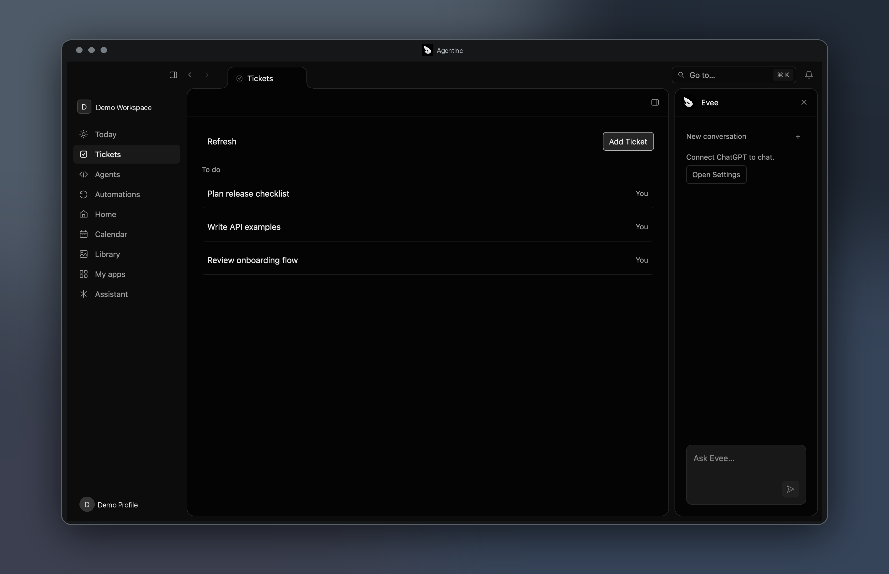
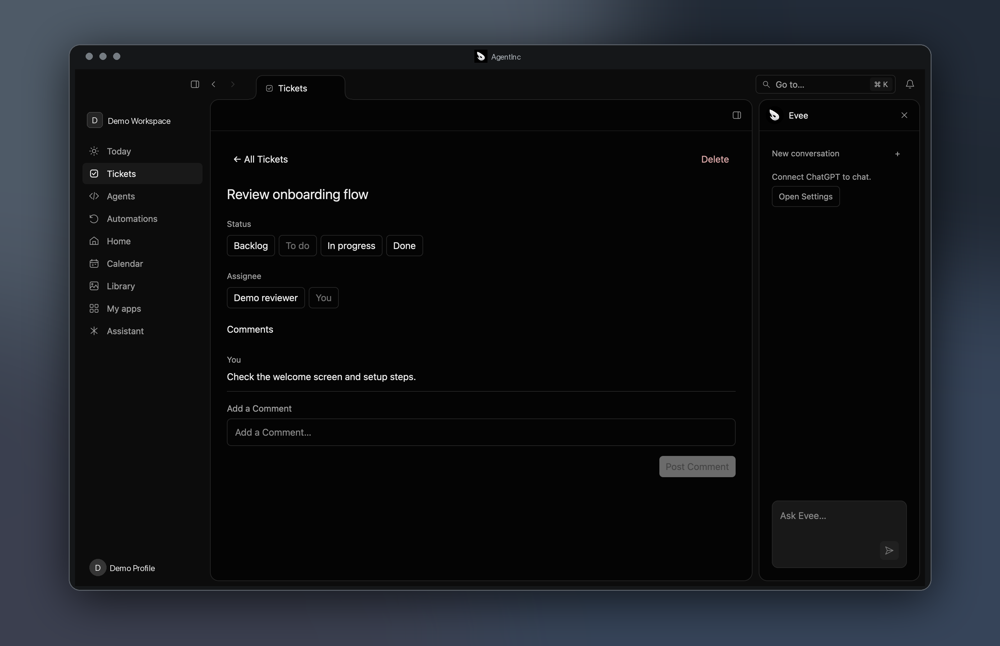
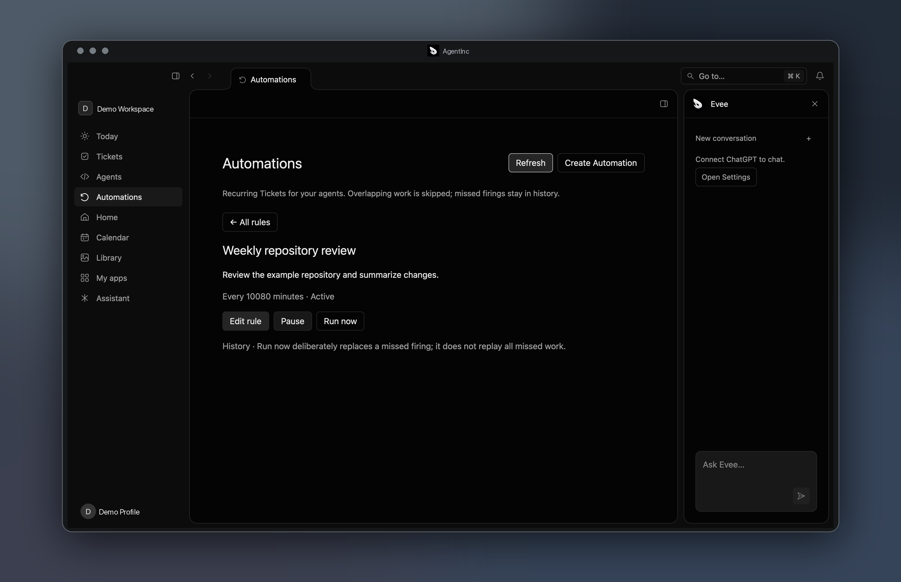
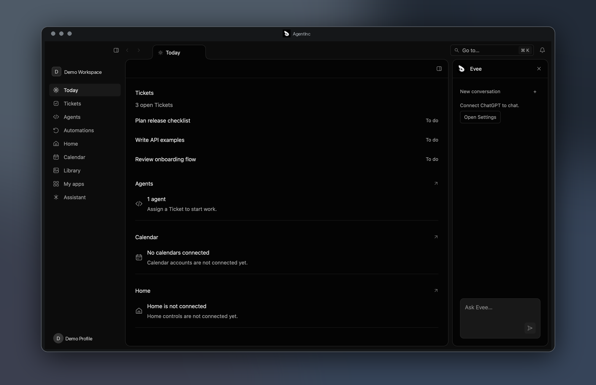
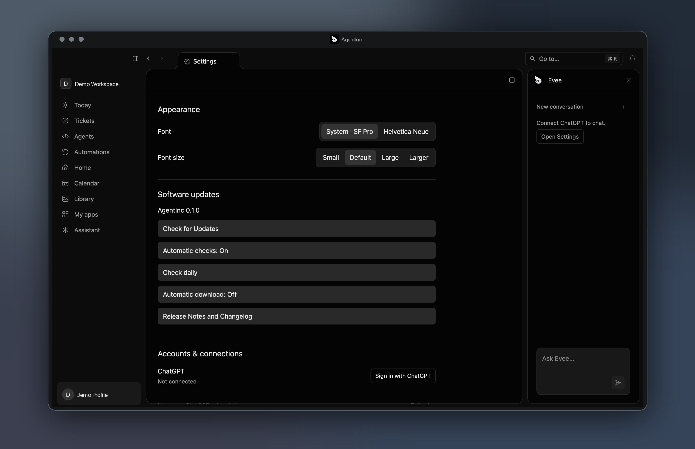

# AgentInc

AgentInc is a native Mac workspace where people and agents work through the same Tickets, Conversations and Automations. Evee is the assistant at the center of that work. The app is built in Rust with GPUI; a local daemon owns product state and durable agent execution.



The first release is a personal, single-machine development environment for agentic coding. The screenshots below use synthetic data and show the current source, including the resizable side panes and neutral color palette; the v0.1.0 download may look slightly different.

## Tour

### Tickets

Track work, assign an agent and keep the work log in comments.



### Automations

Save a rule that starts agent work and inspect its occurrences.



### Evee

Keep the assistant beside the current page in a resizable panel.



### Settings

Adjust app-wide font size and manage the ChatGPT connection.



## Install

Download [AgentInc v0.1.0 for Apple Silicon](https://github.com/0x63616c/agentinc/releases/download/v0.1.0/AgentInc.tar.gz), extract `AgentInc.app` and move it to Applications. It requires **macOS 15 or later**. The signed, notarized bundle includes its local runtime; no separate Docker, database or Temporal installation is needed.

Open the app and use **Settings → Accounts & connections → Sign in with ChatGPT** to connect Evee through the official Codex sign-in. [Release notes and all downloads](https://github.com/0x63616c/agentinc/releases/tag/v0.1.0).

## Build from source

On an Apple Silicon Mac, install Xcode command-line tools and Rust. The workspace pins Rust in `rust-toolchain.toml`. Build an ad hoc signed local bundle from the workspace root:

```sh
crates/ainc-mac/scripts/bundle.sh
```

The source bundle does not include the portable release runtime. To use Tickets and Automations locally, also install Docker, Tilt, the Temporal CLI and PostgreSQL's `psql`. Start `cargo xtask dev` in one terminal, then launch the app from another:

```sh
AINC_DISCOVERY_FILE="$PWD/.local/dev/api-url" \
AGENTINC_SESSION_PATH="$PWD/.local/dev/session.json" \
crates/ainc-mac/dist/AgentInc.app/Contents/MacOS/agentinc-os
```

`cargo xtask doctor` prints this worktree's endpoints; `cargo xtask down` stops its stack. See the [Mac app guide](crates/ainc-mac/README.md) and [development architecture](docs/architecture.md).

## Repository

| Path | Purpose |
| --- | --- |
| [`crates/ainc-mac`](crates/ainc-mac) | Native GPUI app and [app guide](crates/ainc-mac/README.md) |
| [`crates/ainc-daemon`](crates/ainc-daemon) | Product API, state and agent execution |
| [`crates/ainc-client`](crates/ainc-client), [`crates/ainc-cli`](crates/ainc-cli) | Generated API client and CLI |
| [`crates/turnkeel`](crates/turnkeel) | Turnkeel Rust agent SDK; overview below |

The [architecture](docs/architecture.md), [decisions](docs/adr) and [runtime design](docs/phase-3-runtime.md) describe how the pieces fit together. [GPUI Pilot](crates/ainc-mac/docs/GPUI_PILOT.md) is the opt-in native UI capture and automation tool used for these screenshots; [the screenshot recipe](docs/assets/readme/README.md) explains how to regenerate them.

## Turnkeel SDK

**Write durable, observable and testable agents, powered by [Temporal](https://temporal.io).**

Turnkeel is a Rust SDK for building AI agents. Define an agent — model, instructions and tools — start a run, and get a result. It is plain async Rust: no state machine or orchestration code in user code. Runs survive crashes and restarts, failed steps are retried, and every run keeps a history you can read back.

```rust
use turnkeel::{Agent, Runtime, tool};

/// Get the current weather for a city.
#[tool]
async fn get_weather(city: String) -> anyhow::Result<String> {
    Ok(format!("{city}: 22°C, sunny"))
}

let turnkeel = Runtime::local().await?;
let agent = Agent::builder("weather-bot")
    .model(model)
    .tool(get_weather)
    .build();

let answer = turnkeel.start(&agent, "Weather in Lisbon?").await?.result().await?;
```

For a conversation that outlives a single turn, use a `Session`: send messages, read the transcript and keep going.

### Testing Turnkeel

Tests never call a real provider. `turnkeel::testing` gives you `ScriptedModel` for deterministic replies, `testing::run()` to execute an agent end to end, and `assert_transcript()` for ordered assertions.

```rust
let model = ScriptedModel::new().on_user("hello", text("Hi there."));
let agent = Agent::builder("greeter").model(model).build();

let run = turnkeel::testing::run(&agent, "hello").await?;

run.assert_transcript().user("hello").assistant_contains("Hi there.").end();
```

`turnkeel-macros` implements `#[tool]` and is re-exported by `turnkeel`. SDK-only tests run with `cargo test -p turnkeel`. Sessions and tools work; approvals, cancellation, streaming, structured output and MCP tools are planned. See [`AGENTS.md`](AGENTS.md) for the SDK design rules.

## License

[MIT](LICENSE).
