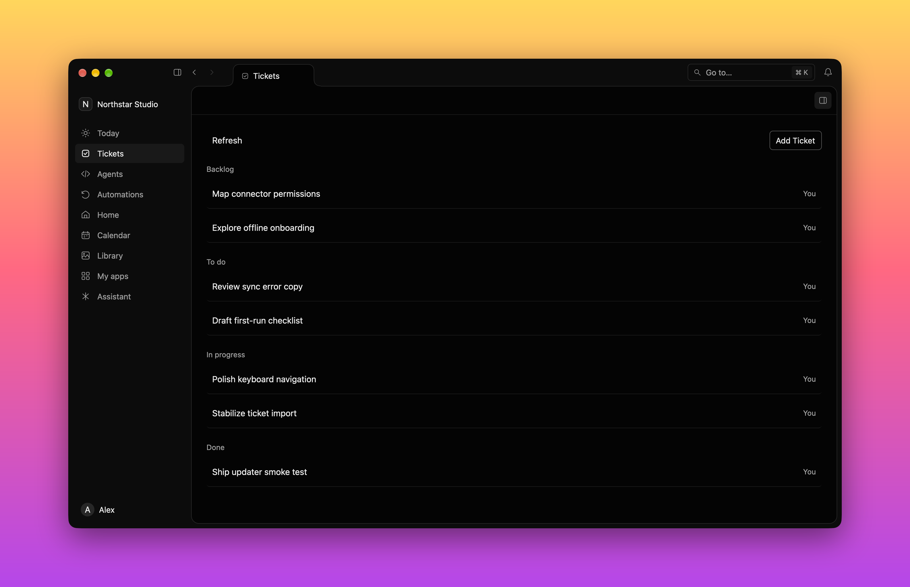

# AgentInc

AgentInc is a native macOS app and local daemon for durable AI agents, powered by [Temporal](https://temporal.io) and built on the [Turnkeel](#turnkeel-sdk) Rust SDK. People and agents work through the same Tickets, Conversations and Automations, with Evee beside the workspace.

The app is a personal, single-machine development environment for agentic coding. The screenshot shows the running native app with synthetic Tickets.

## Install

Download [the latest AgentInc release for Apple Silicon](https://github.com/0x63616c/agentinc/releases/latest), extract `AgentInc.app` and move it to Applications. It requires **macOS 15 or later**. The signed, notarized bundle includes its local runtime; no separate Docker, database or Temporal installation is needed.

Open the app and use **Settings → Accounts & connections → Sign in with ChatGPT** to connect Evee through the official Codex sign-in. [Release notes and downloads](https://github.com/0x63616c/agentinc/releases/latest).

## Develop

You only need three commands, run from the repository root with [just](https://github.com/casey/just) (`just` on its own lists them):

| Command | What it does |
| --- | --- |
| `just dev` | Runs everything under Tilt: Postgres, Temporal, the daemon and the Mac app. Edit the app, the daemon or any crate they depend on and it rebuilds and relaunches. |
| `just test` | Runs every check CI runs: formatting, UI lint scripts, the API-contract check, clippy and all tests. |
| `just release patch` | Bumps the workspace version (`patch`, `minor` or `major`; an explicit version must be one of those next versions), regenerates the API client and commits, refusing on a dirty tree. Pushing that commit to `main` triggers the signed release. |

You need an Apple Silicon Mac with Xcode command-line tools, Rust (pinned in `rust-toolchain.toml`), Docker running, Tilt, the Temporal CLI and PostgreSQL's `psql`. `just dev` leaves its state under `.local/dev/`; `cargo xtask doctor` prints this worktree's endpoints and `cargo xtask down` stops its stack. See the [Mac app guide](crates/ainc-mac/README.md) and [development architecture](docs/architecture.md).

## Repository

Every crate lives directly under `crates/`. The Mac app's directory is `crates/ainc-mac`, but its Cargo package and binary are named `agentinc-os`, which is what `cargo` commands and error messages show.

| Path | What it is |
| --- | --- |
| [`crates/ainc-mac`](crates/ainc-mac) | The native macOS app (GPUI), package `agentinc-os`. [App guide](crates/ainc-mac/README.md) |
| [`crates/ainc-daemon`](crates/ainc-daemon) | `aincd`, the headless daemon: HTTP API, Postgres state and agent execution. The app and CLI are its clients. |
| [`crates/ainc-client`](crates/ainc-client) | Rust API client generated from the daemon's OpenAPI spec (`api/`). Don't edit by hand; run `cargo xtask generate`. |
| [`crates/ainc-cli`](crates/ainc-cli) | `ainc`, the command-line client for the daemon, built on `ainc-client`. [Usage](crates/ainc-cli/README.md) |
| [`crates/ainc-release`](crates/ainc-release) | Release identity (dev vs production channel), client/server version compatibility, signed update manifests and the `ainc-update` installer. |
| [`crates/ainc-xtask`](crates/ainc-xtask) | Dev tooling behind `just dev` and `just release`: `cargo xtask dev`, `serve`, `doctor`, `down`, `generate`, `bump` and `release`. |
| [`crates/gpui-pilot`](crates/gpui-pilot), [`crates/gpui-pilot-cli`](crates/gpui-pilot-cli) | Opt-in UI automation. The library is compiled into an automation build of the app and exposes it over a local socket. The `gpui-pilot` command then reads snapshots, clicks, types, presses keys and takes screenshots. Start a session with `crates/ainc-mac/scripts/pilot.sh`; see [the pilot guide](crates/ainc-mac/docs/GPUI_PILOT.md). |
| [`crates/turnkeel`](crates/turnkeel), [`crates/turnkeel-macros`](crates/turnkeel-macros) | The Turnkeel Rust agent SDK and its `#[tool]` macro; overview below. |
| [`vendor/gpui`](vendor) | Zed's GPUI core crate, pinned to one revision with the pilot patch applied. Kept outside the workspace; `cargo xtask vendor-pilot-gpui` regenerates it. |

The [architecture](docs/architecture.md), [decisions](docs/adr) and [runtime design](docs/phase-3-runtime.md) describe how the pieces fit together. [The screenshot recipe](docs/assets/readme/README.md) explains how to regenerate the native window capture.

## Turnkeel SDK

**Write durable, observable and testable agents, powered by [Temporal](https://temporal.io).**

Turnkeel is a Rust SDK for building AI agents. Define an agent — model, instructions and tools — start a run, and get a result. It is plain async Rust: no state machine or orchestration code in user code. Runs survive crashes and restarts, failed steps are retried, and every run keeps a history you can read back.

```rust
use turnkeel::{Agent, Runtime, tool};

/// Get the current weather for a city.
#[tool]
async fn get_weather(city: String) -> anyhow::Result<String> {
    Ok(format!("{city}: 22°C, sunny"))
}

let turnkeel = Runtime::local().await?;
let agent = Agent::builder("weather-bot")
    .model(model)
    .tool(get_weather)
    .build();

let answer = turnkeel.start(&agent, "Weather in Lisbon?").await?.result().await?;
```

For a conversation that outlives a single turn, use a `Session`: send messages, read the transcript and keep going.

### Testing Turnkeel

Tests never call a real provider. `turnkeel::testing` gives you `ScriptedModel` for deterministic replies, `testing::run()` to execute an agent end to end, and `assert_transcript()` for ordered assertions.

```rust
let model = ScriptedModel::new().on_user("hello", text("Hi there."));
let agent = Agent::builder("greeter").model(model).build();

let run = turnkeel::testing::run(&agent, "hello").await?;

run.assert_transcript().user("hello").assistant_contains("Hi there.").end();
```

`turnkeel-macros` implements `#[tool]` and is re-exported by `turnkeel`. SDK-only tests run with `cargo test -p turnkeel`. Sessions and tools work; approvals, cancellation, streaming, structured output and MCP tools are planned. See [`AGENTS.md`](AGENTS.md) for the SDK design rules.

## License

[MIT](LICENSE).
