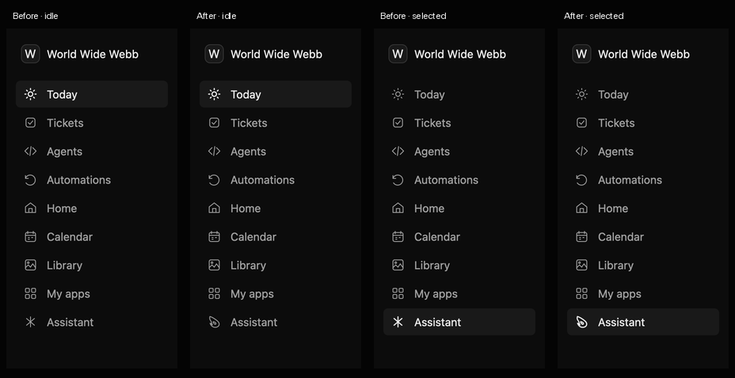
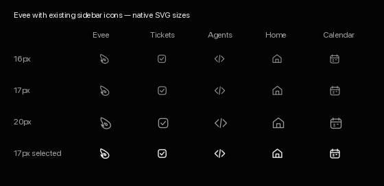

# Evee sidebar outline

The Assistant sidebar item uses `assets/evee-outline.svg`. Its swept silhouette,
returning lower hook, and teardrop eye follow `assets/evee.png`; the shallow nose
indentation and material shading are omitted for small-size legibility.

The icon shares the existing 24×24 grid, unfilled paths, 1.5px stroke, round caps
and joins. The sidebar renders it at 17px through `nav_icon`, including its existing
2px selected stroke and palette tint. The shared route icon and the Evee PNG used
elsewhere are unchanged. Sidebar order is unchanged.

## Visual evidence

The sidebar comparisons crop real GPUI/Metal `rendered_shell` captures from a
1360×828 logical window. Columns show before/after for idle and selected Assistant.
Pixel diffs of the full before/after windows are confined to the Assistant icon
(27×30 backing pixels idle, 27×31 selected).
2× is the original backing resolution; 1× is a Lanczos reduction for logical-size
review. These are native renderer captures, not an HTML recreation.

[Sidebar before and after at 2×](sidebar-before-after-2x.png)

The style boards rasterize the source SVGs with librsvg at 16, 17, and 20px,
plus the 17px selected variant. Evee sits beside the existing Tickets, Agents,
Home, and Calendar icons using the app's normal and selected tints.

[Icon style comparison at 2×](style-comparison-2x.png)

## Validation

- `cargo fmt --all --check`
- `python3 crates/ainc-mac/scripts/check-colors.py`
- `DATABASE_URL=<disposable local Postgres> cargo test --locked`
- `cargo clippy --locked --all-targets -- -D warnings`
- `cargo test --locked -p agentinc-os --features rendered-tests --test rendered_shell`

All checks passed. Workspace tests: 98 passed, 6 ignored. Both baseline and
changed native runs passed all 38 Metal frames and region-removal negative
controls. The workspace test database was a disposable Postgres 16 cluster
inside this worktree, shut down after testing.
