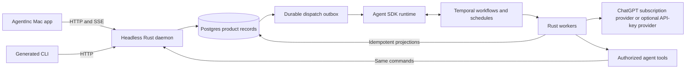

# AgentInc architecture

AgentInc is a personal operating system where people and agents use the same constructs. Development and coding are the first slice; Home, Calendar, Library and other capabilities can grow on the same foundation. Evee is the user's conversational point of contact. Tickets track autonomous work, and Automations create and assign Tickets when they fire.

This is the current plan. The contracts are accepted; the components described below are not all implemented yet. [CONTEXT.md](../CONTEXT.md) defines product language, and [ADRs](adr/) record the decisions.

## Product and workspace

The macOS app is **AgentInc**, bundle ID `co.worldwidewebb.agentinc`. Its GPUI app, assets and acceptance material are imported under `crates/`. The daemon now imports its legacy SQLite product data into Postgres; UI-only preferences remain at the existing support path. See [phase 2 ownership](phase-2-ownership.md) for the implemented boundary and execution limits. All crates stay directly under `crates/`; the SDK is the daemon's agent runtime and the app is its real consumer. The SDK crate is `turnkeel`; product packages use the `ainc-` prefix.

The app remains a native GPUI client with our own components. A generated CLI and authorized agent tools use the same daemon commands. Anything a person can do in the UI must be possible through those tools. A `Route` catalogue names destinations; `Page` views render them. Keep the existing single-tab, dark Control shell and add Tickets and Automations there.

## Runtime and ownership

The daemon owns the API, authorization, domain commands, product migrations and Postgres data. Postgres is authoritative for users, workspaces, agents, Connections, Tickets, Comments, Conversations, Automations, occurrence receipts, user-visible runs and the dispatch outbox. Temporal owns live execution, retries, timers, schedules and workflow history in separate persistence and visibility schemas. Product features do not read Temporal tables. The SDK hides Temporal in its private engine; its public interface speaks in agents, runs, sessions, events, models and tools.

The initial daemon can host API and worker together. It can also run on a Mac Mini or VPS and be reached over Tailscale; the Mac app is not the owner of background work. Remote-capable daemon deployment is part of this plan. Isolated worker **Environments** come later. Local coding needs an available Mac worker until a remote worker path exists. Window closure does not stop acknowledged work.

Commit domain changes and an outbox entry together, then dispatch at least once with stable IDs and idempotent application. Treat a lost acknowledgement after an external effect as an unknown outcome to reconcile, not permission to repeat blindly. Persist Conversation messages and completed replies separately from workflow history so they survive history expiry. Serialize turns within each Conversation and let different Conversations proceed independently. Before claiming restart durability across processes, the SDK needs stable runtime configuration, registration of versioned agent definitions, new-process recovery tests, cancellation and bounded history with internal Continue-As-New. These additions do not expose Temporal in the public SDK.

## Inference and Connections

Agents run on our own SDK loop, with our own tools and observable steps. The first provider signs the user in with **Codex's official ChatGPT OAuth flow**, then calls the **Codex backend Responses endpoint**, following OpenCode's subscription approach. This is for personal use. OpenAI may change that backend, so the integration needs pinned behavior, failure handling and live compatibility checks. An API-key model provider is an option for users who choose it, not a condition for building the loop. Provider sign-in is separate from AgentInc app identity; never pool a user's subscription across users.

Keep the small model-step interface in the SDK and an `inference` module for model selection, provider errors and capabilities. Evee, ticket execution and later AI features all use that seam. A Connection identifies the user's external provider account. Features own their prompts, outputs and permissions; the model never receives database credentials or an unscoped arbitrary-agent-start command.

## Tickets and Automations

A Conversation reply and inline inference need no Ticket. Autonomous work with effects does: Evee or a person creates and assigns a Ticket through the same authorized command. A Ticket has one assignee and exactly four statuses: **Backlog**, **To do**, **In progress**, **Done**. Assignment of actionable work dispatches the agent; starting work moves it to In progress, and completion records a Comment and moves it to Done. Failure or waiting for input is run state, not another Ticket status. Revision checks and assignment generations prevent a stale run from mutating a reassigned Ticket. Comments are the work log; streaming tokens remain run events.

An Automation has a trigger, agent and prompt. Start with a scheduled rule such as every 30 minutes. Every firing is an **Occurrence** that creates and assigns its own Ticket through the normal command; it does not start an agent directly. Temporal Schedules drive firings. For the initial scheduled rule, skip overlapping work, show missed firings, and require deliberate backfill. Pause, Run now and history belong in the app. Event and webhook triggers use the same occurrence path later.

## HTTP, versions and clients

Use Tokio, Axum and Tower for the daemon. Define a documented OpenAPI contract with typed errors, stable operation IDs, revision conflicts, cursor pagination and reconnectable events. Generate the Rust HTTP client and CLI operations from one checked-in contract. Utoipa's OpenAPI 3.1 output and Progenitor's 3.0.x input require a validated 3.0.3 compatibility export; if that becomes substantial tooling, use one 3.0.3 source contract instead. A compiled Ticket client/CLI round trip is the first gate. Keep only CLI startup, auth, output and event following hand-written.

Every request carries `Agent-Inc-Client`, for example `mac/1.4.2 (build 812; api 1)`; every response carries the server version. The server sets a minimum client version and returns one typed **upgrade required** error below it. The generated client also detects **server too old** for its API. The app handles either incompatibility in one generic **Update to continue** screen, without per-feature checks. A `/version` endpoint and separate liveness/readiness checks support diagnostics. A remote daemon upgrades independently from the app, so releases need an explicit compatibility window and expand/contract migrations.

## Data, identity and development

Start with one owner and workspace while storing user, workspace and membership identity explicitly and scoping every command/event stream. The local daemon uses a loopback address and owner-only credential. Remote access uses Tailscale, TLS and an explicit authentication path; external multi-user hosting needs established OIDC and scoped agent credentials before launch. The app may show cached records and drafts while disconnected, marked stale; it does not claim writes or scheduled changes were accepted offline.

Move the existing app's SQLite ownership out of the view, then take a consistent backup and perform a repeat-safe one-way import into Postgres. Preserve Conversation order, interrupted turns and user preferences; do not replay old model calls. SQLite can remain a local cache and draft store after import. SQLx owns checked-in product migrations. A pinned Temporal bootstrap owns Temporal persistence/visibility schemas and namespace setup separately.

Use **Tilt + Docker Compose**, with no Kubernetes requirement for local development. A worktree's canonical path determines its stable instance identity. Each instance has its own Compose project, volumes, networks, Postgres data, Temporal namespace/queues, dynamically discovered loopback ports, credentials and native process state. Bring dependencies up by readiness: Postgres, Temporal schemas, Temporal, namespace, product migrations, then API/worker. Test two concurrent worktrees and restart one without affecting the other.

## Native release and update

One product version drives the app bundle and compatible daemon/client release manifest; the SDK may version independently. Build, test, sign, notarize and verify the app and companion daemon, then publish a signed update archive and release notes. The app owns a **Rust updater** with Sparkle feature parity: app-menu **Check for Updates**, settings, an update window with release notes, **Install and Relaunch / Remind Me Later / Skip This Version**, progress and full changelog. Sparkle through `objc2` is a fallback if parity cannot be delivered safely. The updater works when the product database is unavailable. App relaunch preserves drafts; a bundled daemon update drains intake and resumes durable work after compatibility checks.

## Development environment

`cargo xtask dev` starts the worktree's Tilt + Compose stack and native daemon. `cargo xtask doctor` shows its identity and API discovery; `cargo xtask down` stops that stack without deleting volumes. `cargo xtask generate` exports the Utoipa contract as validated OpenAPI 3.0.3 and regenerates the Progenitor client and CLI operations. The first Ticket endpoint only echoes the DTO to prove the contract; the Ticket domain is a later phase.

`dev/check-isolation.sh WORKTREE_A WORKTREE_B` exercises two disposable worktrees, then restarts one while checking the other's database and health.

## Phased roadmap

| Phase | Work | Acceptance |
|---|---|---|
| **0 — contracts** | Preserve the vision and ADRs; record these decisions and the app import plan. | Documentation agrees on provider, Tickets, names, ownership and version behavior. |
| **1 — isolated development** | Tilt + Compose, migrations and namespace bootstrap, thin health/version API, generated client/CLI spike. | Two worktrees remain isolated; a generated Ticket operation round-trips. |
| **2 — app import** | Import GPUI app; move storage and conversation ownership to daemon; import SQLite data; preserve native flows and preferences. | Real legacy data survives; closing the window leaves acknowledged work running. |
| **3 — durable work** | Stable SDK runtime, subscription provider, outbox, Conversations, four-status Tickets, Comments and coding tools. | New-process recovery, deduplication, permissions, cancellation and reassignment pass with no paid-model dependency in ordinary tests. |
| **4 — Automations** | Scheduled Occurrences create and assign Tickets; pause, Run now and history. | A real Schedule survives restart without duplicate Tickets or effects. |
| **5 — distribution** | Signed releases, Rust updater, compatibility checks and remote daemon validation; then additional users. | Native update, rollback refusal, backup restore and two-user isolation are exercised. |
| **Later** | Event/webhook triggers, Home, Calendar, Library and isolated worker Environments. | Each addition has a real user flow and permission model. |

**Decided 2026-09-23:** One workspace; AgentInc app naming and bundle ID; own agent loop with personal ChatGPT/Codex subscription access and optional API keys; Ticket-gated autonomous effects; daemon/Postgres/Temporal ownership; remote-capable daemon; version headers and central upgrade handling; Rust updater with Sparkle parity; isolated Tilt + Compose development. The SDK is Turnkeel and product packages use the `ainc-` prefix.
